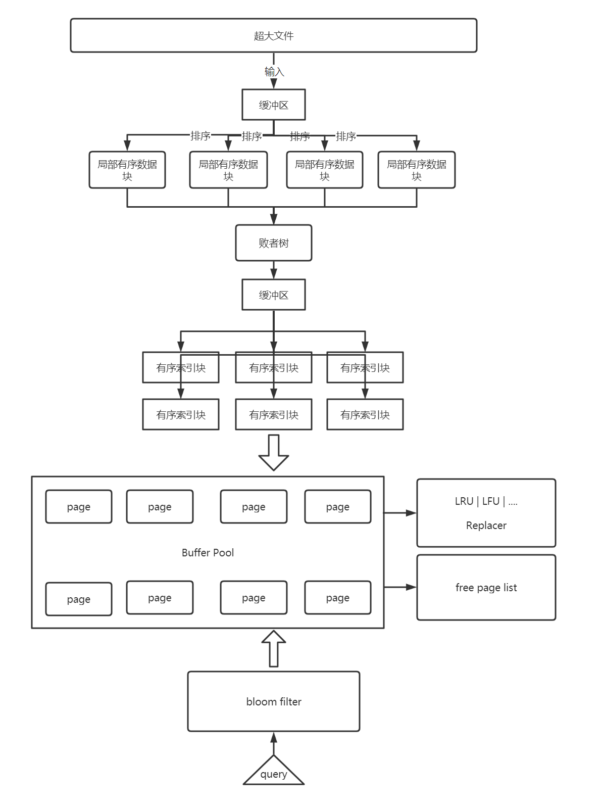

# pingcap-assignment

## 题目

某个机器的配置为：CPU 8 cores, MEM 4G, HDD 4T 这个机器上有一个 1T 的无序数据文件，格式为 (key_size, key, value_size, value)，所有 key 都不相同。

设计一个索引结构，使得并发随机地读取每一个 key-value 的代价最小；读取时 key 必然在文件中且大致符合齐夫分布。 允许对数据文件做任意预处理，但是预处理的时间计入到整个读取过程的代价里

## 整体设计图

## 基本思路

- 索引通过全局有序的有序磁盘块构建（sorted disk block），内存中维护 meta data [block id : block第一个key]，这样就可通过二分查找，确认 key 在哪一个块
- 不直接 load block，而是在 disk block 和 query 之间加入 buffer 层，减少IO操作以及控制资源使用量，并且只能通过 buffer 层访问数据
- buffer 层通过 buffer pool manager 维护，维护一个 free list 管理空闲 内存page，维护 replacer 管理已使用的 page，通过 LRU | LFU 进行淘汰置换，若某个 page 被访问，该块会被 pin，不会被 replacer 换出
- 在 query 前加上 bloom filter ，大幅度过滤无效请求

## 优化

- replacer : Deque -> LRU -> LFU 
  - 提高查询效率
  - 减少抖动
  - 以频率缓存更适应 zipf 分布查询

- bloomfilter : 过滤大量无效查询
- io -> buffer io
  - 降低访问本地磁盘的次数，从而提高效率
  - 提高败者树读入节点的速度，大幅度提升排序性能
- 大量的类型转换
  - 重复利用单个buffer读写，防止buffer不断创建销毁
  - 使用 unsafe point ，减小开销

wanted 

- NIO，构建局部索引块时，sort 和 io 并线进行

- io_ring

- 减低锁细粒度

  - 并发安全链表，锁 node 而不是 list，（锁耦合，确定 加锁方向），写了下，调试问题有点繁琐，后面再加

- 有些地方会有拷贝到内核态开销，后面可以改零拷贝。

- 使用并线 排序算法，优化在多核下的速度

  